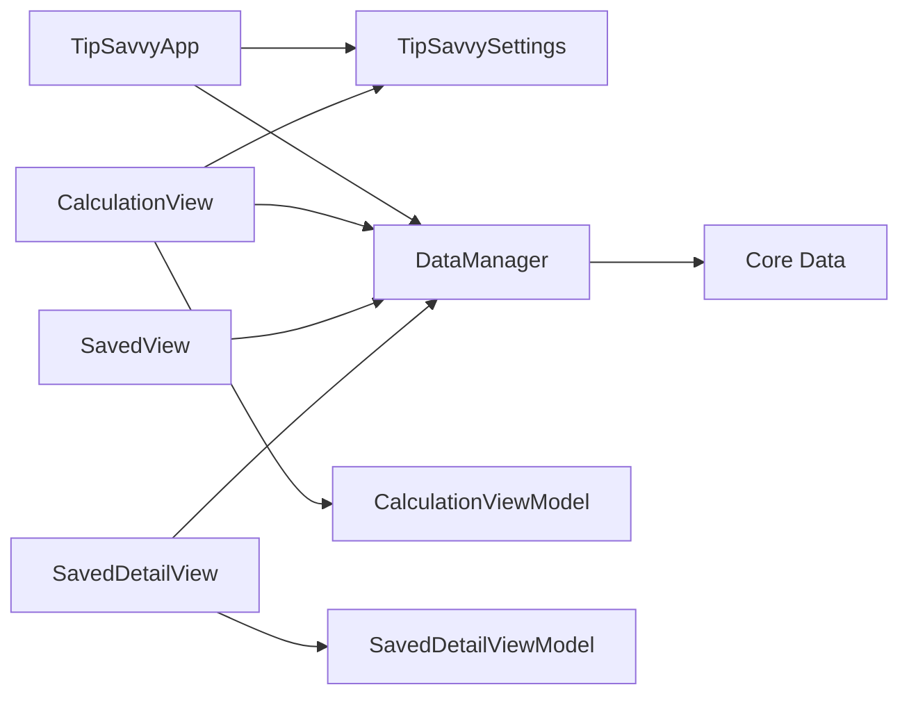

# TipSavvy

TipSavvy is a production-minded SwiftUI tip calculator for iPhone. It calculates bill totals, splits checks, saves named calculations, and gives users quick copy/share actions for settling up.

[](https://apps.apple.com/app/tipsavvy/id6449447909)

## What I Built

- SwiftUI calculator with Dynamic Type-friendly layouts, haptics, validation, rounding modes, copy actions, and persisted defaults.
- Saved tips experience backed by Core Data with persisted search-adjacent sort/filter choices, rename/delete flows, and shareable summaries.
- Settings surface for default tip percentage, default split count, app themes, haptics, locale/currency clarity, and privacy posture.
- Production guardrails: recoverable persistence errors, non-blocking error banners, Crashlytics initialization, UI tests, unit tests, and previews.

## Engineering Highlights



- Architecture: SwiftUI views use observable view models and a protocol-backed saved-tip store boundary for testable persistence behavior.
- Persistence: Core Data writes now return `Result` values and publish user-facing errors instead of crashing with `fatalError`.
- Product polish: the calculator supports exact totals, round-total-up, and round-per-person-up modes without changing the underlying tip calculation.
- Testability: settings, rounding, saved-tip filtering, sort behavior, and persistence edge cases are covered with isolated XCTest fixtures.
- Accessibility: VoiceOver labels, grouped accessibility summaries, Reduce Motion-aware animations, high-contrast-aware panels, and UI tests for discoverability.
- Localization and formatting: copy, share, and accessibility strings use localized labels, while currency values respect the user's current locale.
- App quality: Crashlytics is configured at launch, App Shortcuts open the calculator, privacy-sensitive copy is explicit, and glass UI falls back to system material on older iOS versions.

## Screen Tour

| Calculator | Saved Tips | Saved Detail | Settings |
| --- | --- | --- | --- |
| Validation, copy actions, and rounding modes | Persisted sort/filter choices, search, and clear-filter empty state | Copy/share summary with rename and delete actions | Default tip, default split, app themes, haptics, locale, and privacy posture |

## Requirements

- iOS 16 or later
- Xcode 16.4 or later
- iPhone 8, iPhone SE (2nd generation), or newer

## Tech Stack

- SwiftUI
- Core Data
- Firebase Crashlytics
- XCTest and XCUITest

## Local Verification

TipSavvy uses Firebase Crashlytics. The real `GoogleService-Info.plist` is intentionally ignored and must not be committed. To set up a local or release machine:

1. Rotate or create a replacement Firebase iOS app configuration in Firebase/Google Cloud.
2. Download the new `GoogleService-Info.plist` and place it at the repository root.
3. Use `GoogleService-Info.plist.example` only as a field reference; do not build or release with placeholder values.
4. Revoke any Google API key that has appeared in git history or a secret scanning alert before closing the alert.

```bash
xcodebuild test \
  -project Tippy.xcodeproj \
  -scheme Tippy \
  -testPlan Tippy \
  -destination 'platform=iOS Simulator,name=iPhone 17,OS=latest' \
  CODE_SIGNING_ALLOWED=NO
```

Build-for-testing without running UI tests:

```bash
xcodebuild build-for-testing \
  -project Tippy.xcodeproj \
  -scheme Tippy \
  -testPlan Tippy \
  -destination 'platform=iOS Simulator,name=iPhone 17,OS=latest' \
  CODE_SIGNING_ALLOWED=NO
```

## Release Verification

Run the release preflight before archiving:

```bash
Scripts/release_preflight.sh
```

The preflight checks App Store icon dimensions/alpha, export compliance metadata, release documentation, and local build tooling. Use [Release checklist](docs/ReleaseChecklist.md) for App Store metadata, privacy nutrition, accessibility claims, manual QA, and upload checks.

The preflight also verifies that the local Firebase plist exists, is not the example template, and does not contain the known revoked Google API key from the secret scanning alert.

Manual QA matrix:

- iOS 16, iOS 17, iOS 18, and current beta/latest simulator
- Light mode, dark mode, increased contrast
- Reduce Motion enabled and disabled
- Large Dynamic Type sizes
- Empty saved list, many saved tips, renamed tips, deleted tips
- USD and non-USD device locale/currency settings

Supporting checklists:

- [Accessibility verification](docs/AccessibilityChecklist.md)
- [App Store screenshot plan](docs/AppStoreScreenshotPlan.md)
- [Release checklist](docs/ReleaseChecklist.md)

## Privacy

TipSavvy stores saved calculations locally with Core Data. It does not require an account, and saved bill names or totals are not sent to an app-owned backend. Firebase Crashlytics is configured for crash diagnostics.

Privacy nutrition:

- Account: not required.
- Local data: saved calculations stay in the app's Core Data store on device.
- Diagnostics: Firebase Crashlytics is used for crash reporting.
- Analytics: no product analytics or event tracking is configured.
- Network data: TipSavvy does not sync bill names, totals, or saved calculations to a custom backend.

## Contact

- GitHub: [@kabirdhillon7](https://github.com/kabirdhillon7)
- LinkedIn: [Kabir Dhillon](https://www.linkedin.com/in/kabirdhillon/)
